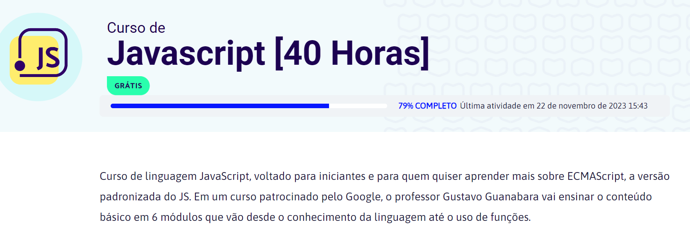

# Learning Javascript Basic

 

# Index

- [Title and Cover Image](#Title-and-Cover-Image)
- [Emblems](#emblems)
- [Index](#index)
- [Project Description](#project-description)
- [Project Status](#Project-Status)
- [Features and Application Demonstration](#functionalities-and-application-demonstration)
- [Project Access](#project-access)
- [Technologies used](#technologies-used)
- [Contributing People](#contributing-people)
- [Conclusion](#conclusion)

# 📖 Description

JavaScript language course, aimed at beginners and for anyone who wants to learn more about ECMAScript, the standardized version of JS, all the classes are here in the repositories. In a course sponsored by Google, professor Gustavo Guanabara teaches the basic content in 6 modules that range from knowledge of the language to the use of functions.

---

<h4 align="center"> 
    :construction:  Project under construction  :construction:
</h4>

# :hammer: Project features

- `Functionalities 1`: Archive my exercises using JS technologies during the course
- `Functionalities 2`: Access my codes whenever I need to remember something.
- `Functionalities 3`: Organize my studies and codes made throughout the course

# 📁 Project access

**It is possible to download all the exercises performed during the course separated by folders**

🛠️ Open and run the project

- Select the file you want
- Use the github "clone" tool
- Copy the SSH format
- Finally use git clone in your VsCode

# ✔️ Techniques and technologies used

- `JAVASCRIPT`
- `HTML`
- `CSS`
- `GIT`

# 👋🤓 Author

[ Isadora Escaraber](https://github.com/IsaEscaraber)

# 🤝 Contributors

| [ Prof. Gustavo
